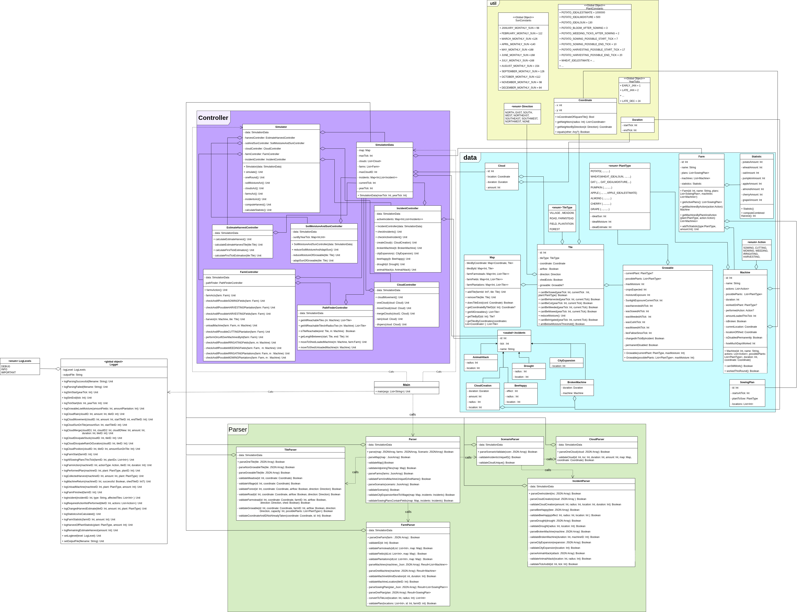

# Saardew Valley — Organic Farming Simulation

Tick-based farming simulation engine built in Kotlin as part of the Software Engineering Lab at Universität des Saarlandes. The simulation models organic farms across a tile-based map with dynamic weather, machine scheduling, plant growth cycles, and random incidents — all driven by a deterministic, greedy planning algorithm.

This was a group project. Below are the components I personally designed, implemented, and tested.

## Architecture

## What I Implemented

- **TileParser** (`src/main/kotlin/de/unisaarland/cs/se/selab/parser/TileParser.kt`) — parses and validates the full tile-based map configuration from JSON, including tile categories, coordinates, accessory properties (airflow, capacity, plant, possiblePlants, shed), and inter-tile adjacency constraints
- **IncidentParser** (`src/main/kotlin/de/unisaarland/cs/se/selab/parser/IncidentParser.kt`) — parses and validates all incident configurations (cloud creation, animal attack, bee happy, drought, broken machine, city expansion), including cross-file validation against the map
- **CloudParser** (`src/main/kotlin/de/unisaarland/cs/se/selab/parser/CloudParser.kt`) — parses initial cloud configurations and validates placement constraints (no two clouds on the same tile, no clouds on village tiles)
- **SoilMoistureAndSunController** — manages per-tick soil moisture reduction across all field and plantation tiles, computes sunlight per tile accounting for cloud traversal and cloud position effects, and triggers harvest estimate adjustments when thresholds are exceeded

## Testing

- System tests (`src/test/kotlin/simon/`) — focused on cloud behavior and incident handling across multiple ticks
- Unit tests (`src/test/kotlin/parser/`) — covering all sub-parsers with valid and invalid inputs, edge cases in validation, and schema conformance

## Tech Stack

Kotlin · Java · Gradle · JUnit · Mockito · detekt · UML · Git

